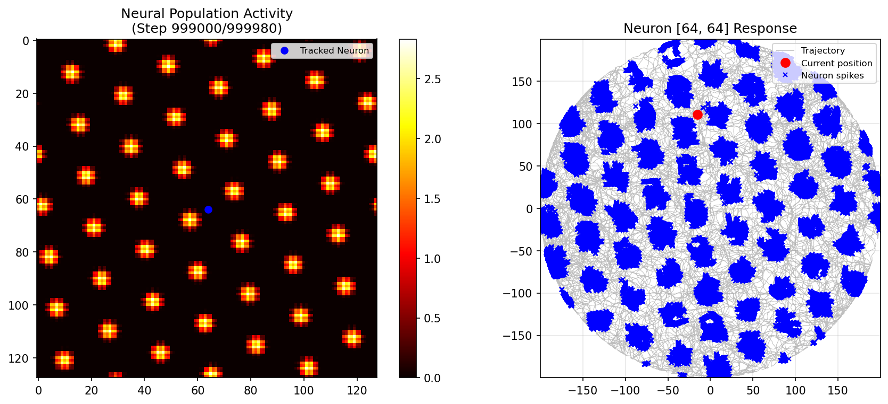

# Grid cell Continuous Attractor Model

Python implementation the continuous attractor network framework described in Y. Burak and I. R. Fiete. [Accurate path integration in continuous attractor network models of grid cells](https://fietelabmit.files.wordpress.com/2018/12/gcdynamics_burakfiete09_plos.pdf). PLoS Comp. Biol. 5(2) (2009).




## Project Structure

```
gridcellscan/
├── gc_periodic.py          # Main simulation engine
├── gc_plotting.py          # Visualization utilities
├── create_gif.py           # Animation creation from frames
├── gc_dynamics.ipynb       # Interactive Jupyter notebook
├── plots/                  # Output directory for visualizations
│   ├── simulation/         # Activity snapshots and trajectories
│   └── connectivity/       # Weight matrix visualizations
├── trajectory_data.npz     # Optional: experimental trajectory data
├── requirements.txt        # Python dependencies
└── README.md              # This file
```

## Installation

### Prerequisites

- Python 3.7 or higher
- conda or pip package manager

### Setup

1. **Clone the repository**:
   ```bash
   git clone <repository-url>
   cd gridcellscan
   ```

2. **Create a virtual environment** (recommended):
   ```bash
   # Using conda
   conda create -n gridcells python=3.9
   conda activate gridcells
   
   # OR using venv
   python -m venv venv
   source venv/bin/activate  # On Windows: venv\Scripts\activate
   ```

3. **Install dependencies**:
   ```bash
   pip install -r requirements.txt
   ```

## Usage

### Quick Start with Jupyter Notebook

The easiest way to get started is using the interactive notebook:

```bash
jupyter notebook gc_dynamics.ipynb
```

Then simply run all cells to execute a complete simulation with default parameters.

### Python Script Usage

```python
from gc_periodic import gc_periodic

# Set parameters
n = 128           # Grid size (128x128 neurons)
tau = 5           # Neural time constant (ms)
dt = 0.5          # Time step (ms)
beta = 0.00014    # Spatial scale parameter
gamma = 0.00015   # Interaction range
abar = 1          # Excitatory amplitude
wtphase = 2       # Directional phase shift
alpha = 1.0       # Velocity gain
module = 1        # Module identifier

# Run simulation
spikes, integrated_x, integrated_y, error, pos_x, pos_y = gc_periodic(
    filename='trajectory_data.npz',  # Or any path to trajectory data
    n=n,
    tau=tau,
    dt=dt,
    beta=beta,
    gamma=gamma,
    abar=abar,
    wtphase=wtphase,
    alpha=alpha,
    useSpiking=False,     # False = rate model, True = spiking
    module=module,
    GET_BAND=False,       # False = grid cells, True = band cells
    BAND_ANGLE=0,
    duration=100000       # Steps if no data file provided
)
```

## Parameters

### Core Network Parameters

| Parameter | Description | Typical Value |
|-----------|-------------|---------------|
| `n` | Grid size (neurons per dimension) | 64, 128 (must be power of 2) |
| `tau` | Neural time constant | 5 ms |
| `dt` | Integration time step | 0.5 ms |
| `beta` | Spatial scale (1/λ²) | 0.00014 |
| `gamma` | Inhibition range | 0.00015 |
| `abar` | Excitatory amplitude | 1.0 |
| `wtphase` | Phase shift for directional weights | 2 pixels |
| `alpha` | Velocity gain | 1.0 |

### Module Scaling

Different modules represent different grid scales, following biological observations:

```python
scale_factor = 1.4 ** (module_number - 1)
lambda_param = 13 * scale_factor  # Grid wavelength
beta = 3 / lambda_param**2
alpha = 1 / scale_factor  # Velocity gain scales inversely
```

- **Module 1**: Smallest grid spacing (~13 cm)
- **Module 2**: Medium spacing (~18 cm)
- **Module 3**: Large spacing (~25 cm)
- **Module 4**: Largest spacing (~35 cm)

## Input Data Format

The simulator can use either:

1. **Experimental trajectory data** (`.npz` format):
   ```python
   np.savez('trajectory_data.npz', 
            position_x=x_coords,  # Array of X positions (cm)
            position_y=y_coords)  # Array of Y positions (cm)
   ```

2. **Auto-generated random walk**: If no file is found, the simulator generates a random trajectory within a circular arena (radius = 200 cm).

## Output

The simulation generates several outputs:

### 1. Return Values
- `spikes`: Spike patterns over time (if `useSpiking=True`)
- `integrated_path_x_cm`: Network-decoded X trajectory (cm)
- `integrated_path_y_cm`: Network-decoded Y trajectory (cm)
- `error`: Path integration error over time
- `position_x`, `position_y`: Actual trajectory

### 2. Visualization Files

All plots are saved in `plots/` directory:

- **Connectivity matrices** (`plots/connectivity/module_X/`):
  - `connectivity_matrix.png`: Weight kernel heatmap
  - `shifted_kernels.png`: Directionally-shifted weight matrices

- **Simulation snapshots** (`plots/simulation/module_X/`):
  - `frame_XXXXXX.png`: Neural activity at each time step
  - `path_integration_comparison.png`: True vs. decoded trajectory
  - `error_over_time.png`: Cumulative error analysis

### 3. Creating Animations

Generate GIF or MP4 from simulation frames:

```python
from create_gif import create_gif_from_frames

create_gif_from_frames(
    module_num=1,
    output_format='gif',  # or 'mp4'
    framerate=20,
    step=1
)
```

## Mathematical Background

### Network Dynamics

The firing rate dynamics follow:

```
τ dr/dt = -r + f(W * r + I_vel)
```

Where:
- `r`: Neural firing rates (n × n grid)
- `W`: Synaptic weight matrix (Mexican Hat profile)
- `I_vel`: Velocity-dependent input
- `f`: Threshold-linear activation function

### Weight Matrix

The connectivity kernel combines excitation and inhibition:

```
W(x,y) = a·exp(-α(x² + y²)) - exp(-(x² + y²))
```

### Velocity Modulation

Movement modulates subpopulations through directional gain:

```
I_vel = v_right·R + v_left·L + v_up·U + v_down·D
```

Where R, L, U, D are checkerboard patterns selecting direction-tuned neurons.

## Citation

If you use this code in your research, please cite:

```bibtex
@article{burak2009accurate,
  title={Accurate path integration in continuous attractor network models of grid cells},
  author={Burak, Yoram and Fiete, Ila R},
  journal={PLoS Computational Biology},
  volume={5},
  number={2},
  pages={e1000291},
  year={2009},
  publisher={Public Library of Science}
}
```

## Contributing

Contributions are welcome! Please feel free to submit a Pull Request.

## License

MIT License

## Contact

For questions or issues, please open an issue on GitHub

## Acknowledgments

- Original model by Burak & Fiete (2009)
- Implementation inspired by https://github.com/FieteLab/Grid-cell-continuous-attractor-models

---

**Note**: This is a research tool. Parameter values are based on published literature but may require tuning for specific applications.
